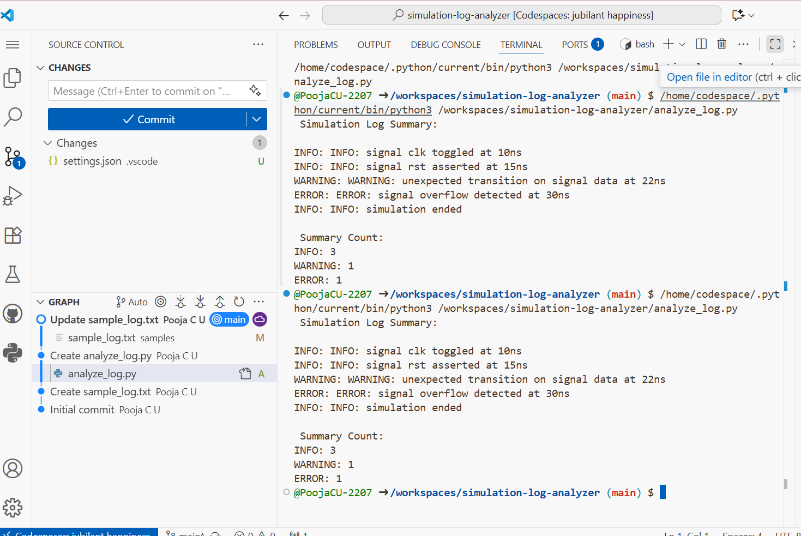

# simulation-log-analyzer
A Python script that parses RTL simulation logs to extract INFO, WARNING, and ERROR messages. Summarizes signal events and anomalies for quick debugging and verification in VLSI workflows. Ideal for automating pre-silicon audit tasks.

